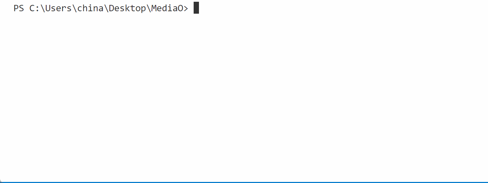

# MediaAO

## 功能概述
MediaAO是从Plex和The Movie Database(TMDb) 获取剧集/电影信息，并对本地指定媒体文件/文件夹重命名，便于播放器刮削识别剧集/电影。测试Plex,Infuse均可正确识别媒体信息。




## 运行环境
- Python 3.6 或更高版本，建议使用 3.10 以上版本。
- 需要安装的Python库：`colorama`，其他均为python的标准库无需下载，程序自带检查安装代码，用户确定即可。
- 需要有访问TMDB API和Plex API的权限
- 首次运行会要去输入 TMDb API 密钥， 用于获取 TMDb 电影/剧集信息，可前往 TMDb 官网免费申请，链接：https://developers.themoviedb.org/3/getting-started/introduction


## 参数说明
- 参数文件为同目录下config.py,
在GitHub的Markdown渲染中，表格的宽度是自动调整的，基于每列的内容。GitHub的Markdown解析器不支持HTML或CSS样式，因此我们不能直接控制列的宽度。但是，我们可以通过调整表格的格式和内容来改善其在GitHub上的显示。

以下是调整后的表格：

| 参数 |  参数类型控制   | 默认值 | 说明 |
| :--- | :--- | :--- | :--- |
| `PLEX_URL` | 必填 |  | Plex服务器的URL |
| `PLEX_TOKEN` | 必填 |  | Plex的令牌 |
| `TMDB_API_KEY` | 必填 |  | TMDB的API密钥 |
| `MOVIES_FOLDER` | 可选 |  | 电影文件夹的路径 |
| `SHOWS_FOLDER` | 可选 |  | 剧集文件夹的路径 |
| `ANIME_FOLDER` | 可选 |  | 动漫文件夹的路径 |
| `CHINESE_DRAMA_FOLDER` | 可选 |  | 国剧文件夹的路径 |
| `DOCUMENTARY_FOLDER` | 可选 |  | 纪录片文件夹的路径 |
| `AMERICAN_DRAMA_FOLDER` | 可选 |  | 美剧文件夹的路径 |
| `JAPANESE_KOREAN_DRAMA_FOLDER` | 可选 |  | 日韩剧文件夹的路径 |
| `SPORTS_FOLDER` | 可选 |  | 体育文件夹的路径 |
| `VARIETY_SHOW_FOLDER` | 可选 |  | 综艺文件夹的路径 |
| `language_option` | 可选 | `zh-CN` | 语言选项，例如"zh-CN"代表中文 |
| `ask_language_change` | 可选 | `false` | 是否询问改变语言 |
| `video_suffix_list` | 可选 | 见详细说明 | 视频文件后缀列表，以逗号分隔 |
| `subtitle_suffix_list` | 可选 | `srt,ass,stl,sub,smi,sami,ssa,vtt` | 字幕文件后缀列表，以逗号分隔 |
| `other_suffix_list` | 可选 | `nfo,jpg,txt,png,log` | 其他文件后缀列表，以逗号分隔 |
| `movie_title_format` | 可选 | 见详细说明 | 电影标题格式，以逗号分隔的字段列表 |
| `debug` | 可选 | `true` | 是否开启调试模式 |
| `move_files` | 可选 | `false` | 表示是否移动文件到指定目录下 |
| `rename_seasons` | 可选 | `false` | 是否重命名季度 |
| `show_delete_files` | 可选 | `false` | 是否删除剧集文件夹下的其他格式的文件 |
| `movie_delete_files` | 可选 | `false` | 是否删除电影文件夹下的其他格式的文件 |
| `tv_name_format` | 可选 | 见详细说明 | 电视名称格式 |
| `elements_to_remove` | 可选 | `%7C,国语中字,简英双字,繁英雙字,泰语中字,3D,国粤双语,HD中字,\\d+分钟版` | 需要从文件名中移除的元素 |
| `elements_regex` | 可选 | `{...}` | 使用正则表达式匹配的元素，包括年份、分辨率、来源、编码、位深、HDR信息、音频格式和编辑版本 |

在这个调整后的表格中，我将"类型"列中的"必填"和"可选"标签直接添加到了参数名中，以便在不增加额外列的情况下提供这些信息。希望这个答案对您有所帮助！
```
所有参数后 `""` 里填写你的参数，以下是各个参数的说明，

- `"PLEX_URL"`: Plex服务器的URL。

- `"PLEX_TOKEN"`: Plex的令牌。

- `"TMDB_API_KEY"`: TMDB的API密钥。

- `"MOVIES_FOLDER"`: 电影文件夹的路径。

- `"SHOWS_FOLDER"`: 剧集文件夹的路径。

- `"ANIME_FOLDER"`: 动漫文件夹的路径。

- `"CHINESE_DRAMA_FOLDER"`: 国剧文件夹的路径。

- `"DOCUMENTARY_FOLDER"`: 纪录片文件夹的路径。

- `"AMERICAN_DRAMA_FOLDER"`: 美剧文件夹的路径。

- `"JAPANESE_KOREAN_DRAMA_FOLDER"`: 日韩剧文件夹的路径。

- `"SPORTS_FOLDER"`: 体育文件夹的路径。

- `"VARIETY_SHOW_FOLDER"`: 综艺文件夹的路径。


- `"language_option"`: 语言选项，例如"zh-CN"代表中文，默认中文。

- `"ask_language_change"`: 是否询问改变语言，参数填写 ”true“ 和 ”false“，默认执行时不选择语言。

- `"video_suffix_list"`: 视频文件后缀列表，以逗号分隔。如："mp4,mkv,flv,avi,mpg,mpeg,mov,ts,wmv,rm,rmvb,3gp,3g2,webm",如果你有其他格式可以自己修改；

- `"subtitle_suffix_list"`: 字幕文件后缀列表，以逗号分隔。如："srt,ass,stl,sub,smi,sami,ssa,vtt",如果你有其他格式可以自己修改；

- `"other_suffix_list"`: 其他文件后缀列表，以逗号分隔。如："nfo,jpg,txt,png,log",如果你有其他格式可以自己修改；

- `"movie_title_format"`: 电影标题格式，以逗号分隔的字段列表。如"chinese_title,english_title,year,resolution,source,codec,audio_format,edit_version",表示按这些元素排列，每个元素以”.“分割，你可以调整顺序或者去掉某些元素。

- `"debug"`: 是否开启调试模式，影响是否输出一些详细信息，默认为true。

- `"move_files"`: 表示是否移动文件到指定目录下，参数填写 ”true“ 和 ”false“，默认不移动。

- `"rename_seasons"`: 是否重命名季度，默认false，如果选择true则会改季文件夹为 ”Season 1“ 这样的格式。

- `"show_delete_files"`: 是否删除剧集文件夹下的其他格式的文件，参数填写 ”true“ 和 ”false“，默认不删除。

- `"movie_delete_files"`: 是否删除电影文件夹下的其他格式的文件，参数填写 ”true“ 和 ”false“，默认不删除。

- `"tv_name_format"`: 电视名称格式，默认："{name}-S{season:0>2}E{episode:0>2}.{title}",。

- `"elements_to_remove"`: 需要从文件名中移除的元素，为更好处理文件名，默认首先删除一些元素，例如："%7C,国语中字,简英双字,繁英雙字,泰语中字,3D,国粤双语,HD中字,\\d+分钟版"，可以自己完善。

- `"elements_regex"`: 使用正则表达式匹配的元素，包括年份、分辨率、来源、编码、位深、HDR信息、音频格式和编辑版本。时这些元素的正则处理，可以自己调整或补充。
```
## 使用指南
1. 首先，您需要在`config.json`文件中设置您的Plex服务器信息和TMDB API密钥。
2. 然后，您可以运行`main.py`来启动程序。
3. 程序会提示您选择匹配模式、库类型、命名规则和父文件夹路径。
4. 根据您的选择，程序会开始处理文件夹，并根据匹配的媒体信息重命名文件夹。

## 注意事项
- 请确保您有权限修改文件夹的名称。
- 在使用此工具之前，请备份您的文件，以防万一出现错误。
- 请确保您的API密钥是正确的，否则程序将无法获取媒体信息。

## 已实现的功能
1. Plex匹配模式：根据Plex库中的媒体信息重命名文件夹。
2. Tmdb匹配模式：根据TMDB中的媒体信息重命名文件夹。
3. 格式转换模式：根据用户选择的命名规则重命名文件夹。
4. 清理命名模式：删除文件夹名称中的非法字符。
5. 批量改电影文件名：通过执行rename_movie.py实现
6. 批量改剧集文件名：通过执行rename_show.py实现

## 免责声明
此工具仅供个人使用，作者不对任何由此工具引起的数据丢失或损坏负责。在使用此工具之前，请确保您已经备份了所有重要的文件。

我们希望这个介绍能帮助您更好地理解和使用MediaAO。如果您有任何问题或建议，欢迎随时提出。祝您使用愉快！
# MediaAO 1.0.7

## Overview
MediaAO is a powerful media file management and renaming tool. Its main goal is to help you organize and manage your movies and TV series, making them easier to search and access.

## Runtime Environment
- Python 3.6 or higher
- Required Python libraries: `colorama`, others are standard libraries and do not need to be downloaded.
- Requires access to the TMDB API and Plex API

## Parameter Description
- The parameter file is `config.py` in the same directory,

```
Fill in your parameters after `""` for all parameters, below is the explanation of each parameter,

- `"PLEX_URL"`: URL of the Plex server.

- `"PLEX_TOKEN"`: Token of Plex.

- `"TMDB_API_KEY"`: API key of TMDB.

- `"MOVIES_FOLDER"`: Path of the movie folder.

- `"SHOWS_FOLDER"`: Path of the series folder.

- `"ANIME_FOLDER"`: Path of the anime folder.

- `"CHINESE_DRAMA_FOLDER"`: Path of the Chinese drama folder.

- `"DOCUMENTARY_FOLDER"`: Path of the documentary folder.

- `"AMERICAN_DRAMA_FOLDER"`: Path of the American drama folder.

- `"JAPANESE_KOREAN_DRAMA_FOLDER"`: Path of the Japanese and Korean drama folder.

- `"SPORTS_FOLDER"`: Path of the sports folder.

- `"VARIETY_SHOW_FOLDER"`: Path of the variety show folder.


- `"language_option"`: Language option, for example, "zh-CN" represents Chinese, default is Chinese.

- `"ask_language_change"`: Whether to ask to change the language, the parameter is filled with ”true“ and ”false“, the default is not to select the language when executing.

- `"video_suffix_list"`: Video file suffix list, separated by commas. Such as: "mp4,mkv,flv,avi,mpg,mpeg,mov,ts,wmv,rm,rmvb,3gp,3g2,webm", if you have other formats you can modify it yourself;

- `"subtitle_suffix_list"`: Subtitle file suffix list, separated by commas. Such as: "srt,ass,stl,sub,smi,sami,ssa,vtt", if you have other formats you can modify it yourself;

- `"other_suffix_list"`: Other file suffix list, separated by commas. Such as: "nfo,jpg,txt,png,log", if you have other formats you can modify it yourself;

- `"movie_title_format"`: Movie title format, a list of fields separated by commas. Such as "chinese_title,english_title,year,resolution,source,codec,audio_format,edit_version", it means to arrange according to these elements, each element is separated by ".", you can adjust the order or remove some elements.

- `"debug"`: Whether to turn on debug mode, affecting whether to output some detailed information, the default is true.

- `"move_files"`: Indicates whether to move files to the specified directory, the parameter is filled with ”true“ and ”false“, the default is not to move.

- `"rename_seasons"`: Whether to rename the season, the default is false, if you choose true, it will change the season folder to the format of ”Season 1“.

- `"show_delete_files"`: Whether to delete other formats of files in the series folder, the parameter is filled with ”true“ and ”false“, the default is not to delete.

- `"movie_delete_files"`: Whether to delete other formats of files in the movie folder, the parameter is filled with ”true“ and ”false“, the default is not to delete.

- `"tv_name_format"`: TV name format, default: "{name}-S{season:0>2}E{episode:0>2}.{title}",.

- `"elements_to_remove"`: Elements to be removed from the file name, for better handling of the file name, some elements are deleted first by default, such as: "%7C,国语中字,简英双字,繁英雙字,泰语中字,3D,国粤双语,HD中字,\\d+分钟版", you can improve it yourself.

- `"elements_regex"`: Elements matched by regular expressions, including year, resolution, source, codec, bit depth, HDR information, audio format, and edit version. When these elements are processed regularly, you can adjust or supplement them yourself.
```
## User Guide
1. First, you need to set your Plex server information and TMDB API key in the `config.json` file.
2. Then, you can run `main.py` to start the program.
3. The program will prompt you to select the matching mode, library type, naming rules, and parent folder path.
4. Based on your selection, the program will start processing the folder and rename the folder according to the matched media information.

## Precautions
- Please make sure you have permission to modify the folder name.
- Before using this tool, please back up your files in case of errors.
- Please make sure your API key is correct, otherwise the program will not be able to obtain media information.

## Implemented Features
1. Plex matching mode: Rename the folder according to the media information in the Plex library.
2. Tmdb matching mode: Rename the folder according to the media information in TMDB.
3. Format conversion mode: Rename the folder according to the naming rules selected by the user.
4. Clean naming mode: Delete illegal characters in the folder name.
5. Batch change movie file name: Achieved by executing rename_movie.py
6. Batch change series file name: Achieved by executing rename_show.py

## Disclaimer
This tool is for personal use only, and the author is not responsible for any data loss or damage caused by this tool. Before using this tool, please make sure you have backed up all important files.

We hope this introduction can help you better understand and use MediaAO. If you have any questions or suggestions, feel free to raise them at any time. Enjoy using it!
